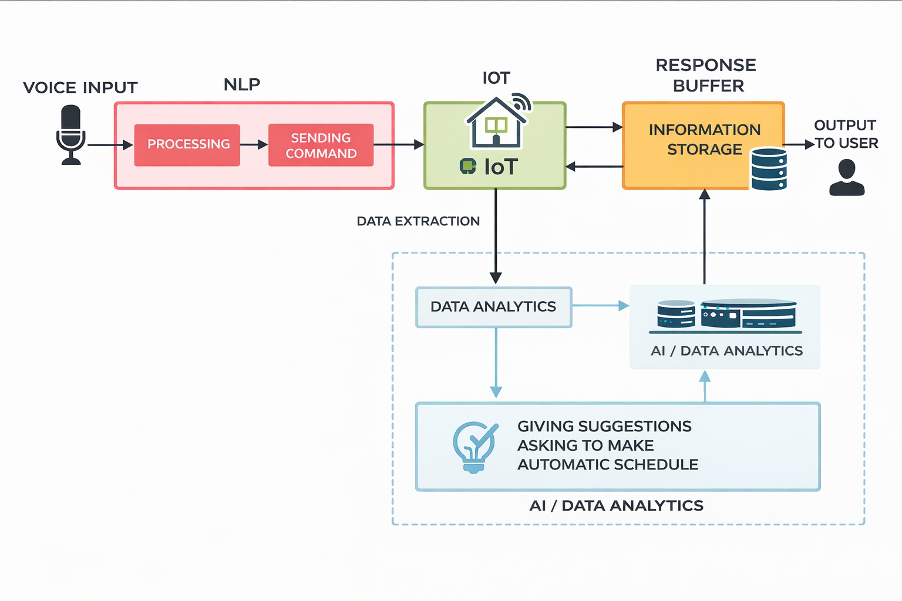
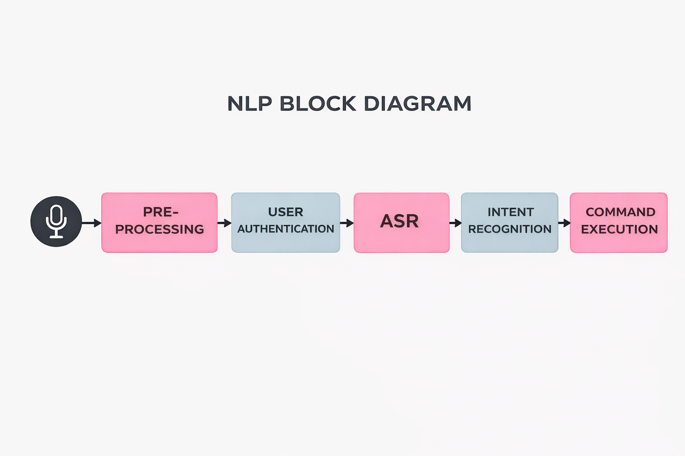
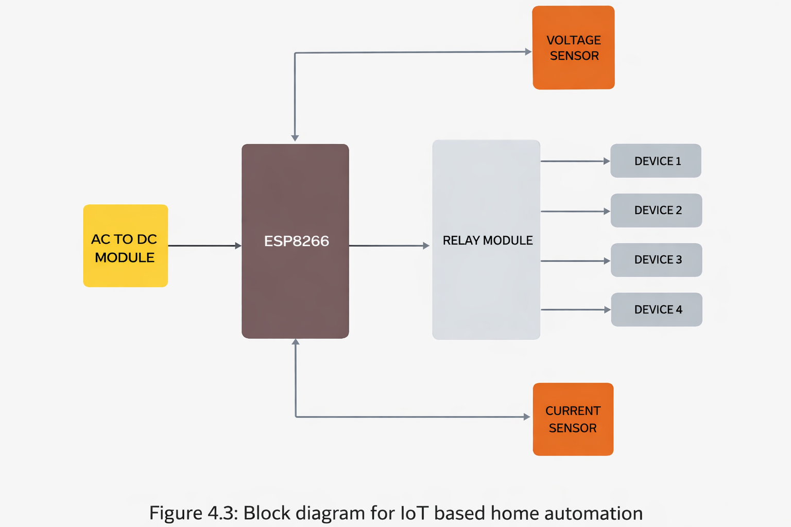

# AI-Powered Voice-Based Smart Home Automation System for Indian Languages

## Overview
This project implements an AI-powered voice-based smart home automation system designed for Indian regional languages and English.  
It enables real-time control of legacy home appliances using natural language voice commands.

The system integrates AI-based speech recognition, NLP-driven command processing, and IoT hardware to achieve end-to-end automation.

## System Architecture

The AI-Powered Voice-Based Smart Home Automation System follows a layered architecture that integrates voice processing, AI-based decision-making, and IoT-based device control.

### High-Level Architecture
The overall system architecture consists of four major components:
- Voice Input & NLP Processing
- IoT Command Execution
- Response Buffer & User Feedback
- AI/Data Analytics for intelligent suggestions

---

### NLP Processing Pipeline
Voice commands are processed through a structured NLP pipeline to ensure accurate interpretation and execution.

Steps involved:
1. Voice Pre-processing
2. User Authentication
3. Automatic Speech Recognition (ASR)
4. Intent Recognition
5. Command Execution

---

### IoT Hardware Architecture
The IoT layer handles real-time control of legacy home appliances using embedded hardware and sensors.

Key components:
- ESP8266 Microcontroller
- Relay Module for device switching
- Voltage and Current Sensors
- AC to DC Power Module

---

### Data Analytics & Automation
System usage data is analyzed to:
- Monitor device behavior
- Generate usage insights
- Provide intelligent automation suggestions
- Enable future scheduling and optimization

---

## Key Features
- Voice command support for Indian regional languages (Hindi, Marathi) and English
- AI-driven voice command processing using NLP
- Real-time automation of legacy home appliances
- End-to-end integration of AI and IoT hardware components

---

## Technologies Used
- Python
- NLP-based Voice Processing
- Arduino
- MQTT Protocol
- Embedded Systems

---
0
## Results
- Validated voice command recognition for Indian regional languages through repeated testing.
- Achieved successful command recognition in approximately 6–8 out of 10 test attempts.
- Demonstrated 100% reliable device response once valid voice commands were recognized.

---

## Supported Languages
- Hindi
- Marathi
- English

---

## Demo Video
▶️ Project Demo:  

---

## Project Type
Academic / System Design Project

---

## Author
Yash Tijare
